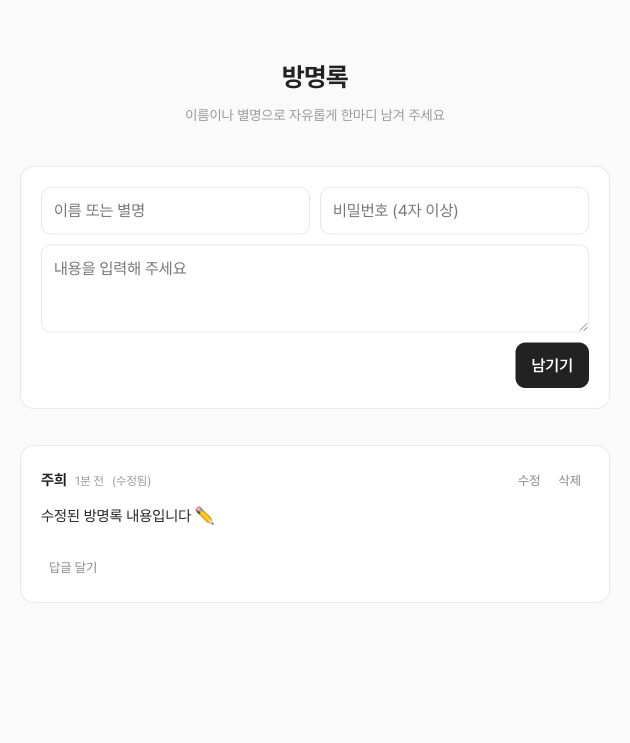

# 방명록

누구나 이름(별명)과 비밀번호로 글을 남기고, 본인이 직접 수정·삭제할 수 있는 온라인 방명록입니다.
글마다 답글을 달 수 있고, 답글도 같은 방식으로 관리됩니다.

> 제작일: 2026-08-08 · 제작 도구: Claude Code
>
> **🌐 공개 주소: https://guestbook-juhee-team.vercel.app**

---

## 미리보기



---

## 주요 기능

| 기능 | 설명 |
|---|---|
| 방명록 작성 | 이름/별명(1~20자) + 비밀번호(4자 이상) + 내용(1~1,000자) |
| 답글 | 글마다 1단계 답글 작성 가능. 답글도 이름 + 비밀번호 + 내용(1~500자) |
| 수정 | 작성할 때 입력한 비밀번호를 알아야 수정 가능. 수정하면 "(수정됨)" 표시 |
| 삭제 | 비밀번호 확인 후 삭제. 글을 삭제하면 달린 답글도 함께 삭제됨 |
| 날짜 표시 | 방금 전 / N분 전 / N시간 전 / 날짜(YYYY.MM.DD) 자동 표시 |

로그인이나 회원가입은 없습니다. 글 단위 비밀번호만으로 본인 확인을 합니다.

---

## 구조

```
┌──────────────────┐         RPC 호출          ┌─────────────────────────┐
│   index.html     │  ──────────────────────▶  │  Supabase (PostgreSQL)  │
│  (정적 페이지)     │   /rest/v1/rpc/...       │  프로젝트: todo-app      │
│  HTML+CSS+JS     │  ◀──────────────────────  │  guestbook_ 테이블 2개   │
└──────────────────┘         JSON 응답          └─────────────────────────┘
```

- **프런트엔드**: `index.html` 파일 하나. 프레임워크·빌드 도구 없이 순수 HTML/CSS/JS로 작성. Pretendard 폰트만 CDN으로 불러옵니다.
- **백엔드**: Supabase `todo-app` 프로젝트(`jcspkkaszsqlwnokqpmz`, 서울 리전)를 재사용. 무료 플랜의 프로젝트 2개 제한 때문에 새 프로젝트 대신 `guestbook_` 접두사 테이블을 추가했습니다. 기존 todo 테이블과는 완전히 분리되어 있습니다.

### 데이터베이스 테이블

**`guestbook_entries`** (방명록 글)

| 컬럼 | 타입 | 설명 |
|---|---|---|
| `id` | uuid | 기본키 (자동 생성) |
| `name` | text | 작성자 이름/별명 (1~20자) |
| `content` | text | 내용 (1~1,000자) |
| `password_hash` | text | 비밀번호의 bcrypt 해시 (원문 저장 안 함) |
| `created_at` | timestamptz | 작성 시각 |
| `updated_at` | timestamptz | 마지막 수정 시각 (수정 전엔 null) |

**`guestbook_replies`** (답글)

| 컬럼 | 타입 | 설명 |
|---|---|---|
| `id` | uuid | 기본키 |
| `entry_id` | uuid | 원본 글 참조 (글 삭제 시 답글도 cascade 삭제) |
| `name` | text | 작성자 이름/별명 (1~20자) |
| `content` | text | 내용 (1~500자) |
| `password_hash` | text | 비밀번호의 bcrypt 해시 |
| `created_at` | timestamptz | 작성 시각 |
| `updated_at` | timestamptz | 마지막 수정 시각 |

### 서버 함수 (RPC)

프런트엔드는 테이블에 직접 접근하지 않고, 아래 7개 함수만 호출합니다.

| 함수 | 역할 |
|---|---|
| `guestbook_list()` | 전체 글 + 답글 목록 조회 (비밀번호 해시는 응답에서 제외) |
| `guestbook_add_entry(이름, 내용, 비밀번호)` | 글 작성 |
| `guestbook_update_entry(id, 비밀번호, 내용)` | 글 수정 (비밀번호 검증) |
| `guestbook_delete_entry(id, 비밀번호)` | 글 삭제 (비밀번호 검증, 답글 포함) |
| `guestbook_add_reply(글id, 이름, 내용, 비밀번호)` | 답글 작성 |
| `guestbook_update_reply(id, 비밀번호, 내용)` | 답글 수정 (비밀번호 검증) |
| `guestbook_delete_reply(id, 비밀번호)` | 답글 삭제 (비밀번호 검증) |

모든 함수는 `{"ok": true}` 또는 `{"ok": false, "error": "안내 문구"}` 형태로 응답합니다.

---

## 보안 설계

정적 페이지는 소스에 API 키가 노출될 수밖에 없어서, 키가 노출돼도 안전하도록 설계했습니다.

1. **비밀번호는 bcrypt 해시로만 저장** — pgcrypto의 `crypt()` + `gen_salt('bf')` 사용. 원문 비밀번호는 어디에도 저장되지 않습니다.
2. **테이블 직접 접근 전면 차단** — RLS(행 수준 보안)를 켜고 정책을 만들지 않아, anon 키로는 테이블을 읽거나 쓸 수 없습니다.
3. **모든 접근은 서버 함수 경유** — 비밀번호 검증·글자 수 검증이 전부 DB 안(SECURITY DEFINER 함수)에서 실행되므로, 클라이언트 코드를 조작해도 우회할 수 없습니다.
4. **비밀번호 해시 비노출** — 목록 조회 응답에 `password_hash` 컬럼이 아예 포함되지 않습니다.

> Supabase 보안 어드바이저에 "anon이 SECURITY DEFINER 함수를 실행할 수 있다"는 경고가 표시되지만, 로그인 없는 공개 방명록이라 익명 호출 허용이 의도된 설계입니다.

한계: 비밀번호를 잊으면 본인도 수정·삭제할 수 없습니다. 이 경우 Supabase 대시보드(Table Editor)에서 직접 지워야 합니다.

---

## 실행 방법

로컬에서 열려면 폴더에서 간단한 웹서버를 하나 띄우면 됩니다.

```bash
cd ~/Desktop/방명록
python3 -m http.server 8931 -d .
```

브라우저에서 **http://localhost:8931** 접속.

> `index.html`을 더블클릭(file:// 방식)해도 대부분 동작하지만, 웹서버로 여는 것을 권장합니다.

## 배포 현황

본인 Vercel 계정(Juhee's projects)의 `guestbook` 프로젝트로 배포되어 있습니다 (2026-08-08).

- **공개 주소**: https://guestbook-juhee-team.vercel.app
- **관리 대시보드**: https://vercel.com/juhee-team/guestbook
- **GitHub 연동**: [anittaesmuyrica1000-hub/guestbook](https://github.com/anittaesmuyrica1000-hub/guestbook) 저장소의 `main` 브랜치에 push하면 **자동으로 재배포**됩니다.
- 배포 보호(Vercel Authentication)는 꺼둔 상태라 누구나 접속할 수 있습니다.
- 이전에 다른 계정(jayjaewoongchoi-2571)으로 배포했던 `guestbook`·`juhee-guestbook` 프로젝트는 폐기 대상입니다. juhee-guestbook.vercel.app 주소도 그쪽 소유라 더 이상 관리하지 않습니다.

별도 서버나 환경 변수 설정은 없습니다. (Supabase 주소와 공개 키가 `index.html` 안에 들어 있습니다.)

---

## 데이터 관리

- 데이터 확인·수동 삭제: [Supabase 대시보드](https://supabase.com/dashboard/project/jcspkkaszsqlwnokqpmz) → Table Editor → `guestbook_entries` / `guestbook_replies`
- 전체 초기화(모든 글 삭제): SQL Editor에서 `delete from guestbook_entries;` 실행 (답글도 함께 삭제됨)

## 파일 구성

```
방명록/
├── index.html           # 방명록 전체 (화면 + 스타일 + 로직)
├── guestbook-final.png  # 화면 스크린샷
├── README.md            # 이 문서
└── docs/
    └── API.md           # CRUD API 상세 문서
```

API를 직접 호출하거나 다른 클라이언트를 만들 때는 [`docs/API.md`](docs/API.md)를 참고하세요.
